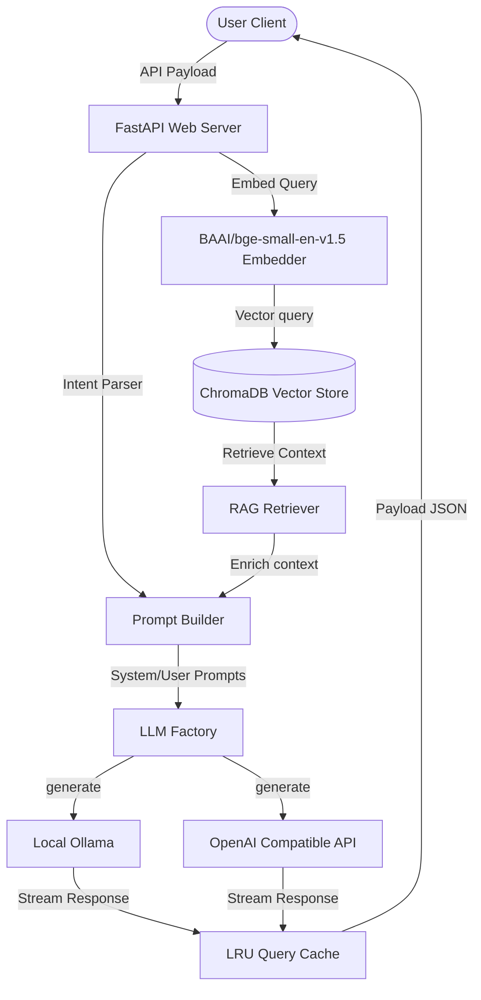

## 🏗️ Tech Stack & Architecture



- **Frontend**: React (v18), TypeScript, Vite, Tailwind CSS, ShadCN UI theme parameters, React Router DOM, Axios, Lucide Icons.
- **Backend**: Python 3.11, FastAPI, Pydantic v2 Settings, ChromaDB Client, Sentence-Transformers, PyPDF.

---

## 📁 Repository Directory Structure

```text
opsai/
├── .github/
│   └── workflows/
│       └── ci.yml          # GitHub Actions CI validation workflow
├── backend/
│   ├── app/
│   │   ├── api/            # API Route controllers (chat, upload, analytics, health)
│   │   ├── llm/            # LLM abstraction (base, ollama, openai, factory)
│   │   ├── models/         # Pydantic validation schemas
│   │   ├── rag/            # RAG components (embeddings, vector_store, retriever, prompt_builder, pipeline)
│   │   ├── services/       # Domain services (csv_loader, document_processor, analytics_service)
│   │   ├── config.py       # Pydantic Settings configuration manager
│   │   ├── dependencies.py # Singleton dependencies injection container
│   │   └── main.py         # FastAPI main script
│   ├── tests/              # Backend integration tests (pytest conftest, test_rag, test_chat)
│   ├── Dockerfile
│   ├── requirements.txt
│   └── ingest.py           # Standalone Python DB ingestion engine
├── frontend/
│   ├── src/
│   │   ├── components/     # UI widgets (Sidebar, ChatInput, ChatMessage, SourceCard, RiskCard, Loader)
│   │   ├── pages/          # Views (Chat, KnowledgeBase, Analytics)
│   │   ├── services/       # Axios client connection mappings
│   │   ├── hooks/          # Custom react hook (useChat)
│   │   ├── types/          # TypeScript model declarations
│   │   ├── App.tsx
│   │   └── main.tsx
│   ├── tests/              # Frontend render test configuration (Vitest)
│   ├── vercel.json         # Vercel deployment routing
│   ├── tsconfig.json
│   ├── tailwind.config.js
│   ├── Dockerfile
│   └── package.json
├── data/
│   ├── sample_trade_knowledge.csv # Sample cargo terms sheet
│   └── Kaizen_Ops_Chatbot_Dataset.csv        # 85-row raw trade knowledge dataset
├── render.yaml             # Render.com backend blueprint config
├── .env.example
├── docker-compose.yml
├── CONTRIBUTING.md
├── CHANGELOG.md
└── LICENSE
```

---

## ⚙️ Environment Variables Setup

Create a `.env` file in the root `opsai/` directory:
```bash
cp .env.example .env
```
Fill in the values according to your environment (local Ollama or OpenAI Cloud):
```env
# Backend Server
PORT=8000
ENVIRONMENT=development
CORS_ORIGINS=http://localhost:5173,http://localhost:3000

# RAG & Embeddings
EMBEDDING_MODEL_NAME=BAAI/bge-small-en-v1.5
SIMILARITY_THRESHOLD=0.25
TOP_K=4
CHROMA_PATH=vector_store/chromadb

# LLM Selection (ollama or openai)
LLM_PROVIDER=ollama
LLM_MODEL=mistral
OLLAMA_URL=http://localhost:11434

# OpenAI compatible API (if LLM_PROVIDER=openai)
OPENAI_API_KEY=your-api-key-here
OPENAI_API_BASE=https://api.openai.com/v1

# Frontend URL
VITE_API_URL=http://localhost:8000
```

---

## 🚀 Running Locally

### Manual Local Run

**1. Database Ingestion**:
Seed the vector database from the sample trade CSV:
```bash
# From root directory (opsai/)
python ingest.py
```

**2. Launch Backend Server**:
Ensure you install backend dependencies from `backend/requirements.txt`:
```bash
cd backend
python3 -m venv venv
source venv/bin/activate
pip install -r requirements.txt
uvicorn app.main:app --reload --host 0.0.0.0 --port 8000
```
Interactive docs will load at `http://localhost:8000/docs`.

**3. Run Backend tests**:
```bash
pytest backend/tests/
```

**4. Launch Frontend Portal**:
```bash
cd ../frontend
npm install
npm run dev
```
The client portal will start at `http://localhost:5173`.

### Docker Compose Run
To launch the frontend, backend, and ChromaDB server together:
```bash
# Build and run containers
docker compose up -d --build

# View logs
docker compose logs -f
```

---

## ☁️ Deployment Steps

### Backend Deployment (Render / Railway)
OpsAI includes a [render.yaml](render.yaml) blueprint. Deploying to Render attaches a persistent SSD disk to preserve vector directories.
1. Create a new Web Service on Render linked to your GitHub repository.
2. Select **Python** as the runtime.
3. Use the following build commands:
   - Build Command: `pip install -r backend/requirements.txt`
   - Start Command: `uvicorn backend.app.main:app --host 0.0.0.0 --port $PORT`
4. Bind Environment Variables from `.env.example`.

### Frontend Deployment (Vercel)
Vercel handles routing redirect rules via [vercel.json](frontend/vercel.json).
1. Import the repository into your Vercel Dashboard.
2. Set the root directory of the project to `frontend`.
3. Set the Build Command to `npm run build` and Output Directory to `dist`.
4. Set the Environment Variable `VITE_API_URL` to your hosted Render backend URL.

---

## 🔌 API Documentation

### `POST /api/chat`
Execute user queries.
- **Request Body**:
  ```json
  {
    "question": "What is FOB?",
    "mode": "quick",
    "user_level": "student"
  }
  ```
- **Response**:
  ```json
  {
    "answer": "Term: FOB\nExplanation: ...",
    "mode": "quick",
    "sources": [...],
    "confidence": "High",
    "related_topics": ["CIF", "Incoterms"]
  }
  ```

### `POST /api/upload-document`
Index reference sheets.
- **Request Type**: `multipart/form-data`
- **File Key**: `file` (accepts `.pdf`, `.csv`, `.txt` up to 10MB)

### `GET /api/analytics`
Fetch server diagnostics.
- **Response**:
  ```json
  {
    "total_questions": 12,
    "mode_distribution": { "quick": 8, "detailed": 4 },
    "popular_terms": [ { "term": "FOB", "count": 6 } ],
    "failed_searches_count": 0,
    "recent_failed_searches": [],
    "average_response_time": 0.452
  }
  ```
